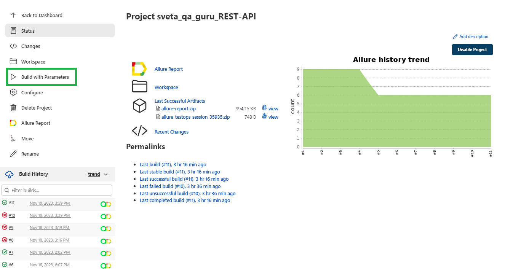
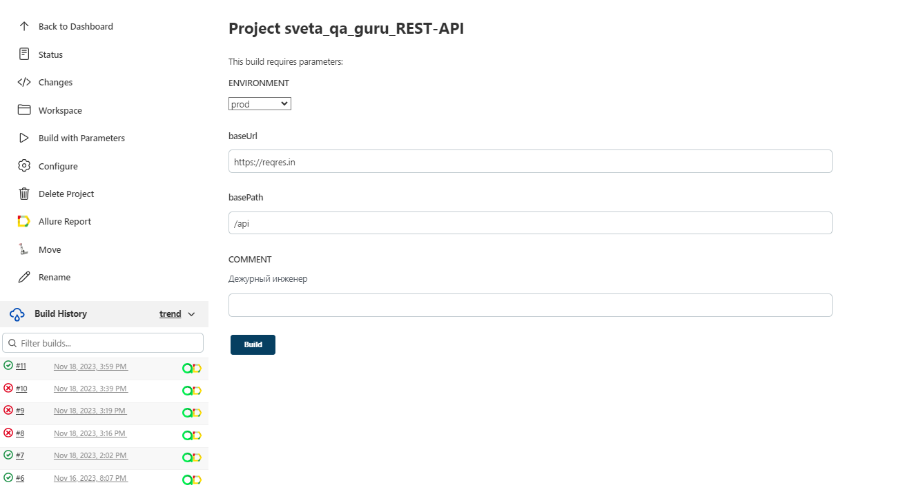
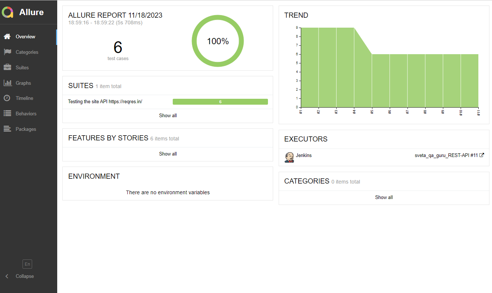
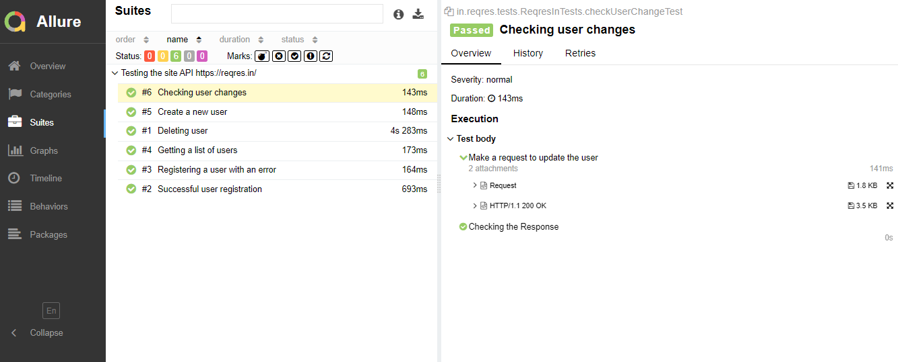
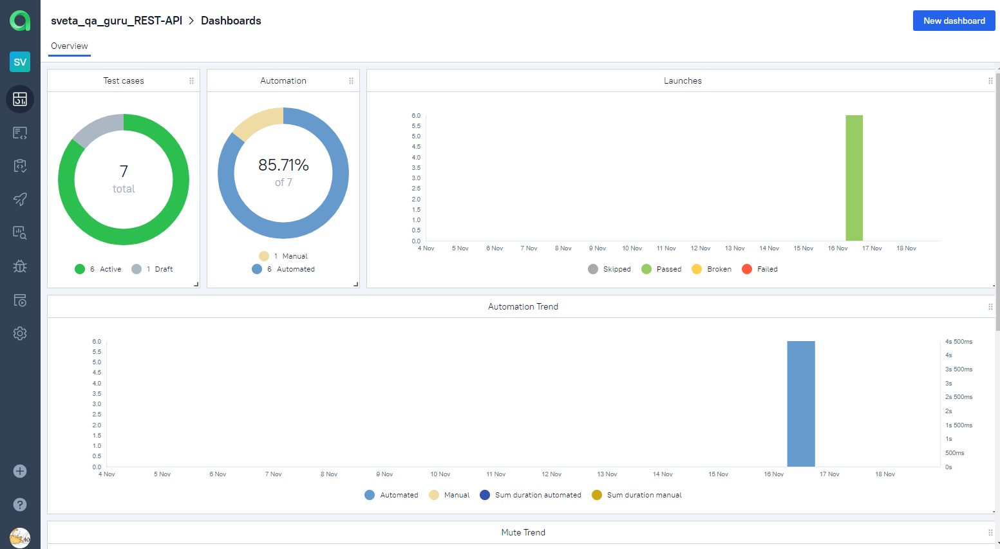
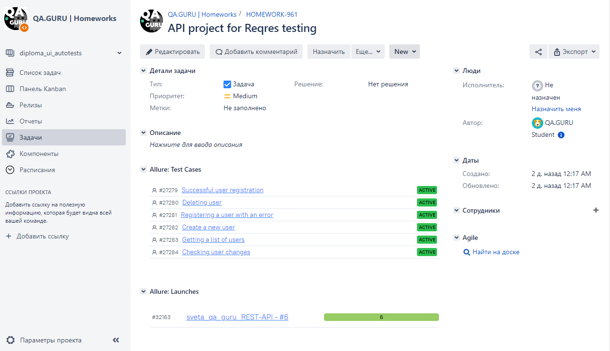

# Проект по  автоматизации тестирования REST API на [reqres.in]([https://siberianhealth.com/ru](https://reqres.in/))


## Содержание:
+ [Технологии и инструменты](#Технологии-и-инструменты)
+ [Реализованные проверки](#Реализованные-проверки)
+ [Запуск тестов из терминала](#Запуск-тестов-терминала)
+ [Запуск тестов в Jenkins](#Запуск-тестов-Jenkins)
+ [Уведомления в Telegram](#Уведомления-Telegram)
+ [Отчеты Allure Report](#Отчеты-Allure-Repor)
+ [Интеграция с Allure TestOps](#Интеграция-Allure-TestOps)
+ [Интеграция с Jira](#Интеграция-Jira)

## <a name="Технологии-и-инструменты">Технологии и инструменты:</a>
<p  align="center">
  <code></code>
  <code></code>
  <code></code>
  <code></code>
  <code></code>
  <code></code>
  <code></code>
  <code></code>
  <code></code>
  <code></code>
  <code></code>
</p>

`Gradle` - используется как инструмент автоматизации сборки.  \
`JUnit5` - для выполнения тестов.\
`REST Assured` - для тестирования REST-API сервисов.\
`Jenkins` - CI/CD для запуска тестов удаленно.\
`Allure Report` - для визуализации результатов тестирования.\
`Telegram Bot` - для уведомлений о результатах тестирования.\
`Allure TestOps` - как система управления тестированием.

## <a name="Реализованные-проверки">Реализованные проверки:</a>
- Создать нового пользователя
- Проверка изменений пользователя
- Успешная регистрация пользователя
- Регистрация пользователя с ошибкой
- Получение списка пользователей
- Удаление пользователя

## <a name="Реализованные-проверки1">Реализованные проверки1:</a>
## <a name="Запуск-тестов-терминала">Запуск тестов из терминала:</a>

```
gradle clean test  
```

## <a name="Запуск-тестов-Jenkins">Запуск тестов в [Jenkins](https://jenkins.autotests.cloud/job/sveta_qa_guru_REST-API/):</a>

Для запуска необходимо нажать "Build with Parameters":



Для запуска сборки необходимо указать значения для параметров:




## <a name="Уведомления-Telegram">Уведомления в Telegram:</a>

С помощью настроенного бота после завершения прогона в Jenkins поступают уведомления в Telegram:


## <a name="Отчеты-Allure-Repor">Отчеты [Allure Report](https://jenkins.autotests.cloud/job/sveta_qa_guru_REST-API/allure/):</a>

<b>Результаты автотестов отражается в Allure Report: </b>  

*Главная страница отчета Allure содержит следующие блоки:*

`ALLURE REPORT` - отображает дату и время теста, общее количество запущенных тестов, а также диаграмму с процентом и количеством успешных, упавших и сломавшихся в процессе выполнения тестов    \
`TREND` -  отображает тенденцию выполнения тестов для всех запусков   \
`SUITES` - отображает распределение тестов по сьютам   

 

*Подменю "Suites":*

В подменю “Suites” отображается список тестов, сгруппированных по наборам. Для каждого теста указан его статус. Также можно посмотреть подробную информацию о каждом тесте: тэги, продолжительность и подробные шаги выполнения.

 

## <a name="Интеграция-Allure-TestOps">Интеграция с [Allure TestOps](https://allure.autotests.cloud/project/3800/dashboards):</a>
> Ссылка доступна только авторизованным пользователям.

 

## <a name="Интеграция-Jira">Интеграция с [Jira](https://jira.autotests.cloud/browse/HOMEWORK-961):</a>

 
